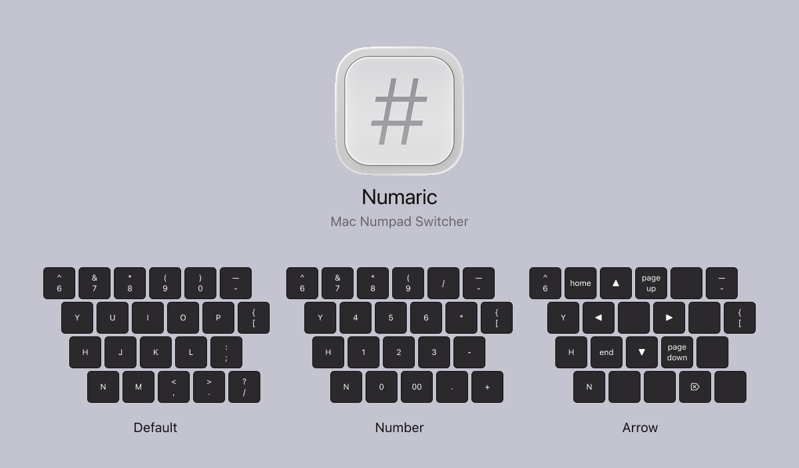

# Numaric - Mac小键盘切换工具 (100% Vibe Coding)

## 功能

- 一键切换键盘特定键位为小键盘模式
- 自定义切换快捷键（默认：Cmd+Opt+K）
- 键位映射：J→1, K→2, L→3, U→4, I→5, O→6, M→0, 逗号→00，/→+，;→-，P→*，0→/，以及方向键模式
- 系统托盘运行，不占用Dock空间
- 设置自动保存

## 安装

1. 将 `Numaric.app` 拖放到 `/Applications` 文件夹
2. 打开系统设置 → 隐私与安全性 → 辅助功能
3. 点击"+"按钮，添加 Numaric 应用
4. 勾选 Numaric 以授予辅助功能权限
5. 启动应用，在系统托盘点击图标开始使用

---

# Numaric - Mac Numpad Switcher (100% Vibe Coding)

## Features

- One-click switch to numpad mode for specific keyboard keys
- Customizable toggle shortcut (default: Cmd+Opt+K)
- Key mapping: J→1, K→2, L→3, U→4, I→5, O→6, M→0, Comma→00, /→+, ;→-, P→*, 0→/, and arrow key mode
- Runs in system tray, no Dock space occupied
- Settings automatically saved

## Installation

1. Drag `Numaric.app` to your `/Applications` folder
2. Open System Settings → Privacy & Security → Accessibility
3. Click "+" button and add Numaric app
4. Check Numaric to grant accessibility permissions
5. Launch the app and click the icon in system tray to start using
